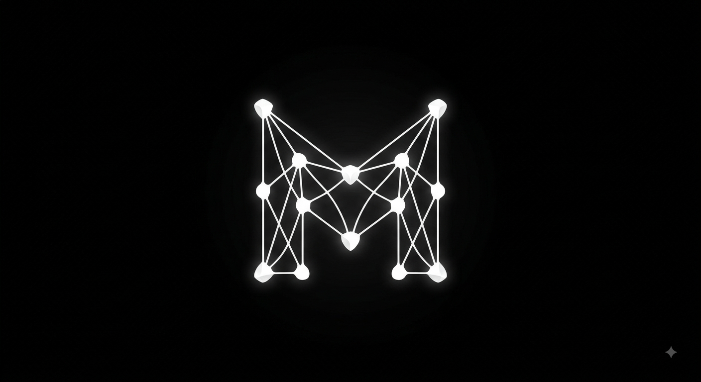

<div align="center">



# Crag — GraphRAG Knowledge Base

**Turn documents, URLs, and YouTube videos into a searchable knowledge graph you can chat with.**

[](LICENSE)
[](https://www.python.org/)
[](https://fastapi.tiangolo.com/)
[](https://nextjs.org/)
[](https://github.com/HKUDS/LightRAG)
[](https://www.sbert.net/)

[Quick start](#prerequisites) · [How it works](#project-flow) · [API](#api-surface-backend) · [Chrome extension](#chrome-extension) · [Layout](#repository-layout)

</div>

---

A full-stack hybrid **vector + knowledge-graph RAG** application. Feed it documents,
URLs, YouTube videos, or pasted text, and it builds a searchable knowledge base
combining vector similarity search with an automatically extracted entity/relationship
graph (via [LightRAG](https://github.com/HKUDS/LightRAG)).

The project has two independently runnable parts:

- **`backend/`** — FastAPI service that owns ingestion, deduplication, the LightRAG
  engine, and the document inventory.
- **`frontend/`** — Next.js dashboard for uploading content, browsing the knowledge
  base, chatting with it, and (soon) exploring the graph.

---

## Tech stack

### Backend
| Layer | Choice |
|---|---|
| Framework | FastAPI + Uvicorn |
| RAG engine | [LightRAG](https://github.com/HKUDS/LightRAG) (`lightrag-hku`) — hybrid vector + graph retrieval |
| Graph extraction | Local [GLiNER](https://github.com/urchade/GLiNER) encoder (`gliner_small-v2.1`), zero-shot against the `ENTITY_LABELS` ontology — one forward pass per window instead of one LLM call per chunk, so ingest isn't bound by an API rate limit. `EXTRACTION_BACKEND=llm` restores the Groq/Ollama path |
| LLM | Split by role via LightRAG's `role_llm_configs`: Groq (`llama-3.3-70b-versatile`) for keyword extraction (and for graph building when `EXTRACTION_BACKEND=llm`), OpenRouter (`openrouter/free`, OpenRouter's auto-router over its free models, by default) for answering (chat query generation) — kept on separate keys so ingest and chat don't compete for the same quota. Both fall back to a local Ollama model if their key is unset or the call fails |
| Embeddings | Local, via `sentence-transformers` (`all-MiniLM-L6-v2`, 384-dim) — no API key required |
| Document parsing | PyMuPDF (PDF), `trafilatura` (web articles), `youtube-transcript-api` (YouTube transcripts) |
| Metadata store | SQLite (`aiosqlite`) — tracks file name, source type, hash, chunk count, size, date added |
| Storage | LightRAG's own KV/vector/graph stores, persisted to disk under `backend/storage/kb/` |

### Frontend
| Layer | Choice |
|---|---|
| Framework | Next.js 16 (App Router) + React 19 + TypeScript |
| Styling | Tailwind CSS 4 |
| Components | shadcn/ui on top of `@base-ui/react` |
| State | Zustand |
| Icons | lucide-react |

---

## Project flow

1. **Ingest** — a user uploads a file (PDF/TXT/MD), submits a URL (web article or
   YouTube link), or pastes raw text from the **Knowledge Base** page.
2. **Extract** — the backend picks the right parser (`app/services/parsers/`) to pull
   plain text out of the source (PDF text, article body via `trafilatura`, or a
   YouTube transcript).
3. **Deduplicate** — the text is normalized and SHA-256 hashed
   (`app/services/dedup.py`). If a document with the same hash already exists, the
   existing record is returned instead of re-ingesting.
4. **Index** — the text is handed to the shared `LightRAG` instance
   (`app/services/lightrag_engine.py`), which:
   - chunks it (512 tokens, ~10% overlap),
   - embeds chunks locally via `sentence-transformers`,
   - extracts entities and relationships into a knowledge graph with a local
     GLiNER encoder (`app/services/gliner_extract.py`) scored against the
     `ENTITY_LABELS` ontology — one forward pass per ~150-word window, no API
     and no rate limit. Set `EXTRACTION_BACKEND=llm` to go back to per-chunk
     Groq/Ollama extraction, which is bound by tokens-per-minute (~2
     chunks/min) rather than by model speed,
   - persists everything to `backend/storage/kb/`.
5. **Track** — a metadata row (doc id, file name, source type, chunk count, size,
   timestamp) is written to the SQLite manifest (`backend/storage/manifest.sqlite3`)
   so the frontend can list/delete documents without querying LightRAG directly.
6. **Browse / manage** — the **Knowledge Base** dashboard page lists every ingested
   document (via `GET /api/v1/knowledge-base`) and lets you delete one (via
   `DELETE /api/v1/knowledge-base/{doc_id}`), which removes it from both LightRAG and
   the manifest.
7. **Query** — the **Chat** page sends each message to
   `POST /api/v1/chat/stream` (`app/api/chat.py`), which runs LightRAG's `mix`-mode
   retrieval (vector + graph), re-ranks the retrieved chunks with a local
   cross-encoder (`app/services/reranker.py`), caps the assembled context at
   `QUERY_CONTEXT_TOKEN_BUDGET`, and streams the response back over Server-Sent Events:
   a `sources` event first (the retrieved reference/file list), then a `token` event
   per generated chunk, then `done`. The UI renders tokens as they arrive and shows a
   collapsible source list under the answer.
8. **Explore the graph** — the **Graph** page renders an interactive force-directed
   view (2D canvas or 3D WebGL, toggle in the toolbar) of the extracted entity graph,
   fetched from `GET /api/v1/graph`. Nodes are colored by entity type (a fixed,
   frequency-ranked categorical palette — see `frontend/src/components/graph/entity-colors.ts`),
   sized by degree, and searchable by name. Clicking a node opens a detail panel with
   its description, source file, and relationships. Above `max_nodes`, LightRAG keeps
   the highest-degree nodes and returns the induced subgraph; nodes left with no
   surviving edges are dropped so they don't float free in the layout.

### API surface (backend)

| Method | Route | Purpose |
|---|---|---|
| POST | `/api/v1/ingest/file` | Upload one or more files (PDF/TXT/MD) |
| POST | `/api/v1/ingest/url` | Ingest a web article or YouTube URL |
| POST | `/api/v1/ingest/text` | Ingest pasted text |
| GET | `/api/v1/knowledge-base` | List all ingested documents |
| DELETE | `/api/v1/knowledge-base/{doc_id}` | Remove a document from the KB |
| POST | `/api/v1/chat/stream` | Ask a question; streams an SSE response (`sources` → `token`×N → `done`) |
| GET | `/api/v1/graph` | Get the entity/relationship graph (`label`, `max_depth`, `max_nodes` query params) |
| GET | `/health` | Health check |

---

## Prerequisites

- **Python 3.12** (a `.venv` already exists in `backend/`)
- **Node.js 18+** and npm
- A **Groq API key** ([free tier](https://console.groq.com/keys)) — optional, but
  recommended for speed/quality
- **Ollama** running locally (`ollama serve`) with a pulled model (e.g.
  `ollama pull llama3.2`) — required as a fallback if you don't set a Groq key, or
  if a Groq call fails

---

## Running the backend

```bash
cd backend

# Activate the existing virtual environment
# Windows (PowerShell):
.venv\Scripts\Activate.ps1
# Windows (cmd):
.venv\Scripts\activate.bat
# macOS/Linux:
source .venv/bin/activate

# Install/update dependencies
pip install -r requirements.txt

# Configure environment (copy and edit as needed)
cp .env.example .env
```

Then edit `backend/.env`. Every setting is documented inline in
[`backend/.env.example`](backend/.env.example) — that file is the source of truth;
the ones you'll actually care about first:

```env
GROQ_API_KEY=            # leave blank to skip Groq and use Ollama only
OPENROUTER_API_KEY=      # answering fallback; blank falls through to Ollama
ZENROWS_API_KEY=         # blank falls back to trafilatura for URL scraping
OPIK_API_KEY=            # blank disables LLM tracing
EXTRACTION_BACKEND=gliner  # 'llm' for the per-chunk Groq/Ollama path
```

It runs with **all four keys blank** — embeddings, graph extraction, and
re-ranking are local; only answering needs an LLM, and Ollama covers that.

Start the API:

```bash
uvicorn app.main:app --reload --port 8000
```

The API is now live at `http://localhost:8000` (docs at `http://localhost:8000/docs`).
Data is persisted under `backend/storage/` (LightRAG's graph/vector/KV files plus the
`manifest.sqlite3` inventory), so restarting the server does not lose ingested data.

### LLM tracing (Opik)

If `OPIK_API_KEY` is set, every LLM call is traced to [Opik](https://www.comet.com/opik)
via `@opik.track` on `app/services/lightrag_engine.py`'s provider functions
(`llm_model_func` for entity/keyword extraction, `query_llm_func` for chat
answering, each nested under a Groq/OpenRouter/Ollama provider span) plus
`ingest_text` in `app/services/ingestion.py` as the parent trace for a
document's extraction calls. Leave `OPIK_API_KEY` blank to disable tracing —
nothing else changes. `OPIK_WORKSPACE` defaults to your account's default
workspace if unset.

---

## Running the frontend

```bash
cd frontend

npm install

# Configure environment (copy and edit as needed)
cp .env.local.example .env.local
```

Edit `frontend/.env.local`:

```env
NEXT_PUBLIC_API_BASE_URL=http://localhost:8000
```

Start the dev server:

```bash
npm run dev
```

Open `http://localhost:3000` — it redirects to `/dashboard/knowledge`.

Other scripts: `npm run build` (production build), `npm run start` (serve production
build), `npm run lint` (ESLint).

---

## Running both together

1. Start Ollama if you're not using Groq: `ollama serve` (and make sure the model in
   `OLLAMA_MODEL` has been pulled).
2. Start the backend: `uvicorn app.main:app --reload --port 8000` (from `backend/`,
   venv activated).
3. Start the frontend: `npm run dev` (from `frontend/`).
4. Visit `http://localhost:3000`, upload/paste/link some content, and watch it
   appear in the **Inventory** table once processed.

---

## Chrome extension

`extension/` is a no-build Manifest V3 popup with two tabs: **Clip** (send the
current page's URL, or just your text selection, to the knowledge base) and
**Chat** (stream an answer without leaving the tab you're on). Load it via
`chrome://extensions` → Developer mode → Load unpacked → select `extension/`.
See `extension/README.md` for details.

---

## Repository layout

```
Crag/
├── backend/
│   ├── app/
│   │   ├── api/            # FastAPI routers: ingest.py, knowledge_base.py, chat.py, graph.py
│   │   ├── core/           # config.py — env-driven settings
│   │   ├── models/         # schemas.py — Pydantic request/response models
│   │   ├── services/
│   │   │   ├── lightrag_engine.py  # the single shared LightRAG instance
│   │   │   ├── ingestion.py        # dedup -> LightRAG insert -> manifest row
│   │   │   ├── dedup.py            # text normalization + SHA-256 hashing
│   │   │   ├── manifest.py         # SQLite document inventory
│   │   │   └── parsers/            # pdf.py, url.py, youtube.py, text.py
│   │   └── main.py         # FastAPI app + CORS + lifespan (init/shutdown RAG)
│   ├── storage/             # LightRAG graph/vector/KV stores + manifest.sqlite3
│   ├── requirements.txt
│   └── .env.example
├── frontend/
│   ├── src/
│   │   ├── app/
│   │   │   ├── dashboard/
│   │   │   │   ├── knowledge/  # Knowledge Base page (upload, URL, paste, inventory)
│   │   │   │   ├── chat/       # Chat page — streaming Q&A over the knowledge base
│   │   │   │   └── graph/      # Graph Explorer page — 2D/3D force-directed view
│   │   │   └── page.tsx        # redirects to /dashboard/knowledge
│   │   ├── components/
│   │   │   ├── knowledge/      # Dropzone, UrlInput, PasteSandbox, InventoryTable, ...
│   │   │   ├── chat/           # ChatMessageBubble (message + collapsible sources)
│   │   │   ├── graph/           # GraphExplorer, ForceGraphCanvas, entity-colors
│   │   │   └── ui/              # shadcn primitives (button, card, table, ...)
│   │   ├── lib/api.ts          # typed fetch wrappers around the backend API
│   │   └── store/knowledge-store.ts  # Zustand store for the document list
│   └── .env.local.example
├── extension/                # Chrome extension (Manifest V3, no build step)
│   ├── manifest.json
│   ├── popup.html / popup.css / popup.js
│   ├── api.js                # fetch wrappers (mirrors frontend/src/lib/api.ts)
│   └── markdown-lite.js       # tiny markdown renderer for the chat popup
├── scripts/gen_logo_assets.py  # regenerates the extension icons from logo.png
├── lightrag_hybrid/          # early standalone prototype, superseded by backend/ — kept for reference, not wired into the app
└── rag-fullstack-toolkit/   # Claude Code plugin/skills used to scaffold this project
```

---

## Roadmap

- ~~**Phase 2 — Chat**: Q&A over the knowledge base using LightRAG's hybrid query
  modes.~~ ✅ Done — see `POST /api/v1/chat/stream` and the **Chat** dashboard page.
- ~~**Phase 3 — Graph Explorer**: interactive 2D/3D visualization of the extracted
  entity/relationship graph.~~ ✅ Done — see `GET /api/v1/graph` and the **Graph**
  dashboard page (force-directed 2D/3D view, search, legend, node detail panel).
